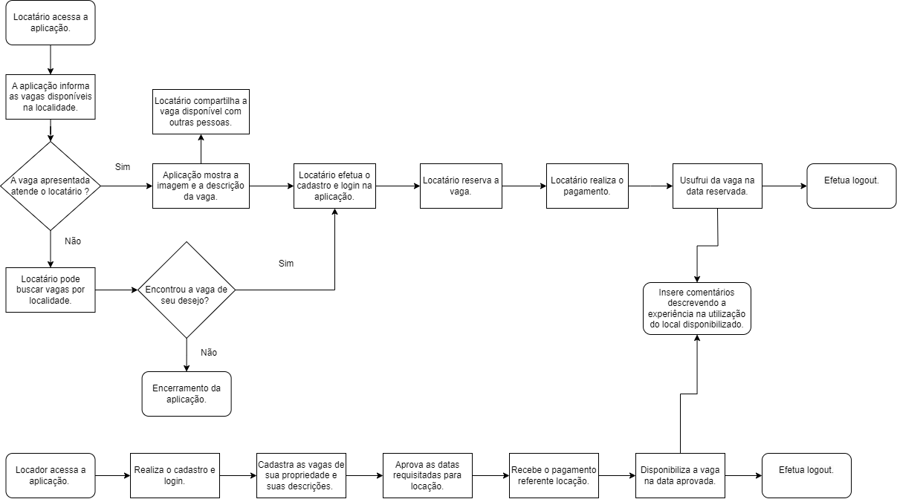

# Projeto de Interface

Pré-requisitos: <a href="2-Especificação do Projeto.md"> Documentação de Especificação</a>

Visão geral da interação do usuário pelas telas do sistema e protótipo interativo das telas com as funcionalidades que fazem parte do sistema (wireframes).

 Apresente as principais interfaces da plataforma. Discuta como ela foi elaborada de forma a atender os requisitos funcionais, não funcionais e histórias de usuário abordados nas <a href="2-Especificação do Projeto.md"> Documentação de Especificação</a>.

## Diagrama de Fluxo

O diagrama apresenta o estudo do fluxo de interação do usuário com o sistema interativo.

## Wireframes
Os Wireframes são esboços do projeto de um site, que represetam de uma forma visual e básica a estrutura do site, nas páginas a seguir, veja o detalhamento de cada uma dessas páginas.

 
 
 
 
 

Também há o wireframes representando a forma visual para mobiles, conforme segue abaixo: 

